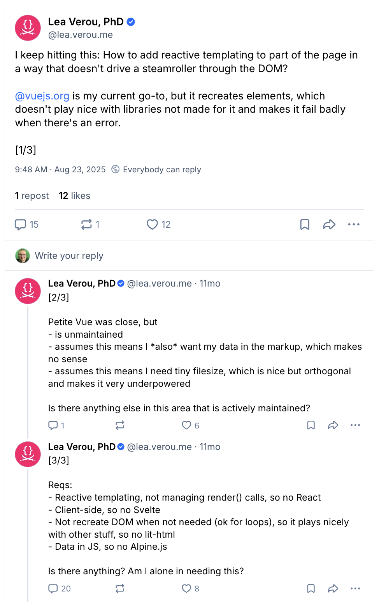

# `downflow`

Reactive DOM updates in a way that don't drive a steamroller through your DOM

## Documentation

<https://konnorrogers.github.io/downflow>

## Inspiration

<https://bsky.app/profile/lea.verou.me/post/3lx34db4osc23>

## Internal Structure

`exports/` is publicly available files
`internal/` is...well...internal.

`exports` and `internal` should **NOT** write their own `.d.ts` that are co-located.

`types/` is where you place your handwritten `.d.ts` files.
